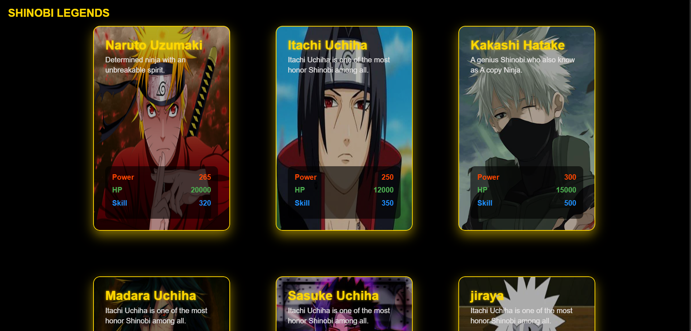
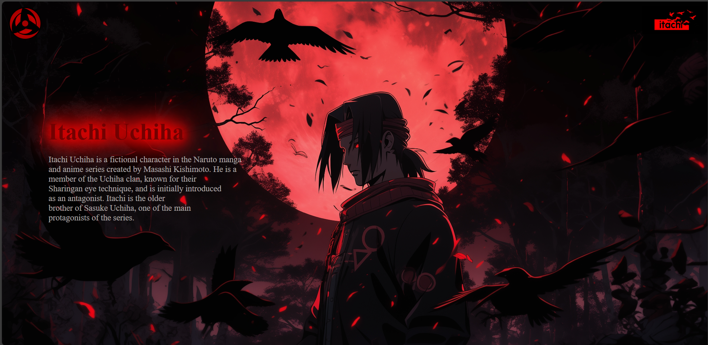
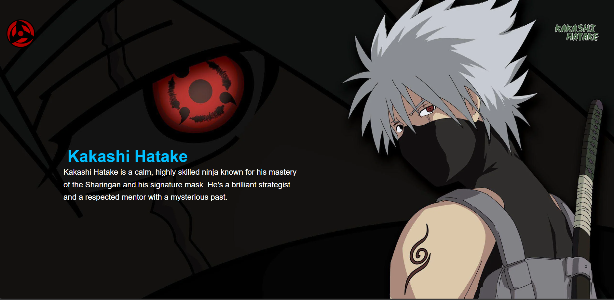
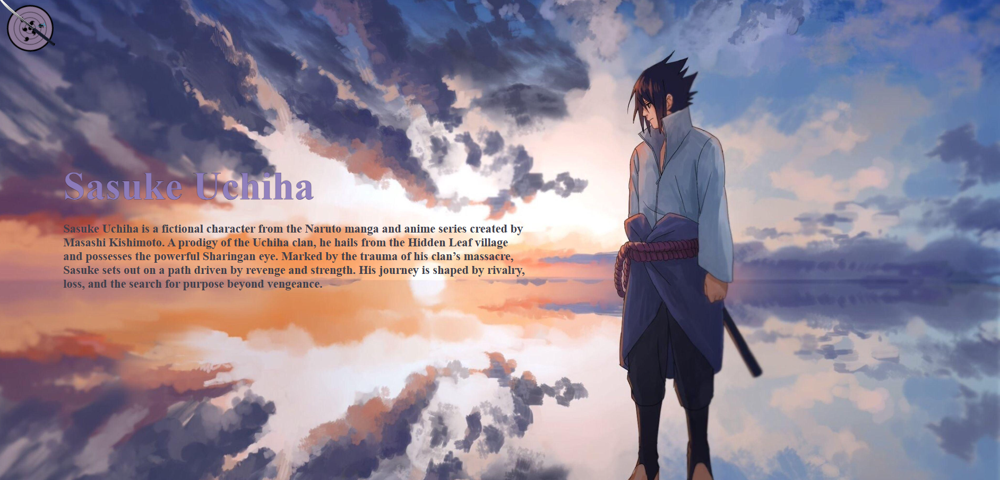
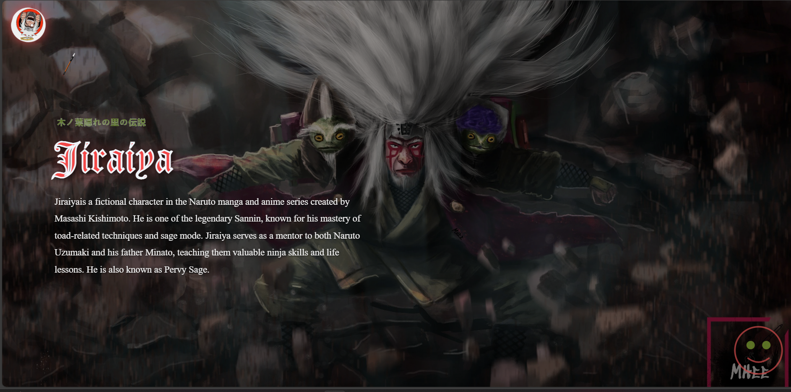
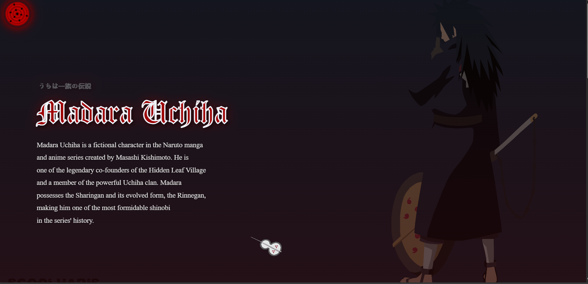
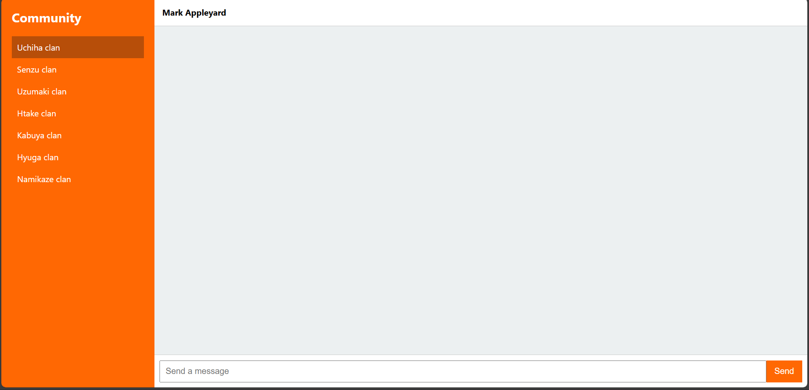

🍥 Naruto Anime Fan Website
A fan-centric website dedicated to the iconic anime series Naruto, offering an immersive digital space for fans to explore characters, episodes, and join the community.

📝 Table of Contents
About the Project

Features

Tech Stack

Installation

Usage

Screenshots 

Project Structure

Contributing

Contact

📌 About the Project
This is a visually rich, fan-centric web application devoted to Naruto. It captures the aesthetic and storytelling essence of the anime with a playful and dynamic user interface. Designed for fans by a fan, the website features interactive character profiles, a detailed episode database, and a dedicated discussion forum where users can express their thoughts, theories, and favorite moments.

✨ Features
🎨 Themed UI inspired by the Naruto universe

🧑‍💻 Interactive character profiles with bios and powers

💬 Community discussion forum

⚡ Smooth micro-interactions and playful animations

🛠 Tech Stack

Technology	Purpose

HTML	Markup and structure
CSS	Styling and animations
JavaScript	Interactivity and DOM manipulation

🚀 Installation
Clone the repository:
bash
Copy
Edit
git clone https://github.com/ayush-verma-004/Shinobi-verse.git
cd Shinobi-verse
Open the index.html file in your browser:

You can double-click index.html or use a live server extension in VS Code.

🔧 Usage
Navigate through different sections (Characters, Episodes, Forum).

Click on characters to view detailed profiles!

Use the episode filter to search for your favorite arc.

Join discussions in the community forum.

🖼 Screenshots / Demo

🔗 Live Demo 
    https://ayush-verma-004.github.io/Shinobi-verse/

🗂 Project Structure

    Card 
    Community
    Profiles
    top
    index.html

🤝 Contributing
Got cool ideas or want to help improve the project? Contributions are welcome!
Fork the repo, make your changes, and submit a pull request. 💥

📬 Contact

Team leader 
    Name:- Ayush verma
    Skills:- Backend developer , Prompt engineer , React , Machine learning.
    Others :- Team leader
    Email: ayushverma593773@gmail.com
    GitHub: https://github.com/ayush-verma-004

Team members 

    Name :- Sahil sahu
    Skills :- Js developer
    Email :- sahusahil553@gmail.com

    Name :- Syuash chaturvedi 
    Skills :- Js developer
    Email :- schaturvedi0690@gmail.com

    Name :- Ronit Gupta
    Skills :- Js developer, Prompt engineer , Uses of AI tools
    Email :- ronitgupta6996@gmail.com

    Name :- Suyash pawar 
    Skills :- Js developer
    Email :- suyashani990@gmail.com
